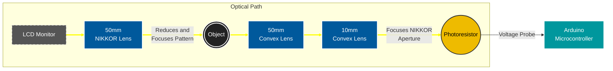

# 🧱 Tessera
A single pixel camera using Hadamard basis compressed sensing.

**Languages and Frameworks**\
  \
**OS Support**\
 

**My website**\

## 📋 Overview

### Hardware:
The apparatus used to capture test images is a very low-cost visible light detection setup.\
It consists of:

        **1. Light:** An LCD monitor projects Hadamard patterns. The objective lens focuses the light patterns onto the object.\
        **2. Object:** The object masks light from the pattern, blocking some from the detector.\
        **3. Collection:** The field lens and relay lens condense the light and focus the objective lens’ aperture onto the detector.\
        **4. Detection:** The photoresistor converts the resulting light intensity into a measurable voltage to be read by an Arduino.

Samples were taken of all Hadamard patterns to allow for easy reordering in post.

The elements of the optical train are held together with 3D printed mounts that make it easy to focus the NIKKOR lens and photoresistor.

### Software:
The software is comprised of three elements:

* **Patterning:**
    * Generate Hadamard patterns
    * Order patterns by sequency (# of sign changes)
    * Display patterns
 
* **Sampling:**
    * Capture and store brightness values from the photoresistor
 
* **Reconstruction:**
    * The final image is reconstructed using a fast Walsh-Hadamard transform

## 📸 Usage
|Main Menu|Scan Progress|
|--|--|
|||

1. Navigate using the arrow and enter keys.
2. Configure the settings to match your setup requirements:
   - Resolution: Enter the desired output resolution. Ensure the resolution is smaller than that of the coded aperture
   - Sample Rate: Ensure this is equal to or slower than the sensor's maximum sample rate.
   - Sensor Port: Select the sensor's serial connection port.

3. Finally, press start and sampling will begin. A periodic preview will be saved to ./out/preview.pgm

## 🖼️ Results
> All example captures were made using a generic photoresistor and an aperture value of f/11 on the front NIKKOR lens.

|Mountain (64px)|Balloon (256px)|Tulip (64px)|Arrow (32px)|
|--|--|--|--|
|||||

## 🧪 Experimental Setup

## 👨‍🎓 Research Poster
### [Download](https://github.com/user-attachments/files/26288451/UrsemP_Poster_ResearchDay26.pdf)

