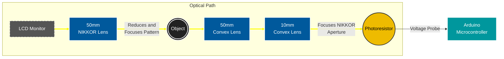

# 🧱 Tessera

> *Tessera has been tested on MacOS, support for other platforms is currently unknown*

## 📋 Overview

### A Single Pixel Camera
Tessera is a hardware and software implementation of compressed sensing with a single photodetector.

### Hardware
The current implementation of the sensing hardware is an apparatus consisting of: 
- A 50mm NIKKOR lens
- An object placed at the NIKKOR lens's focal point
- A 50mm lens directly behind the object
- A 10mm lens direclty behind the 50mm lens
- A photoresistor placed so the aperture of the NIKKOR lens is sharp.
- An arduino microcontroller for analog measurements over serial

The elements of the optical train are held together with 3D printed mounts that make it easy to focus the NIKKOR lens and photoresistor. The photoresistor is monitored by an arduino that passes serial data to the main computer.

### Software
The software is composed of two elements:
* **Patterning:**
    * Generating Hadamard patterns
    * Ordering patterns for Walsh sequency
    * Display patterns
 
* **Reconstruction:**
    * Get the weight of each pattern and sum them to obtain a result
    * The weight of each pattern is determined by the light intensity measured by the sensor.
    * A simplified final expression is $`x = \sum H_ny_n `$ where x is the result, $`H_n`$ is the Hadamard pattern being sampled and $`y_n`$ is the light intensity measured.

## 📸 Usage
|Main Menu|Scan Progress|
|--|--|
|||

1. Navigate using the arrow and enter keys.
2. Configure the settings to match your setup requirements:
   - Resolution: Enter the desired output resolution. Ensure the resolution is smaller than that of the coded aperture
   - Sample Rate: Ensure this is equal to or slower than the sensor's maximum sample rate.
   - Sensor Port: Select the sensor's serial connection port.

3. Finally, press start and sampling will begin. A periodic preview will be saved to ./out/preview.pgm

## 🖼️ Results
> All example captures were made using a generic photoresistor and an aperture value of f/11 on the front NIKKOR lens.

|Tulip (64x64)|Arrow (32x32)|
|--|--|
|||

## 🧪 Experimental Setup
     
In later trials I covered the apparatus with more cloths to block ambient light, though Tessera should eliminate ambient light through averaging.

